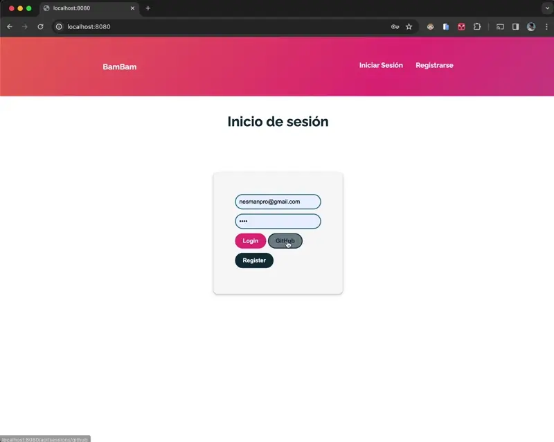
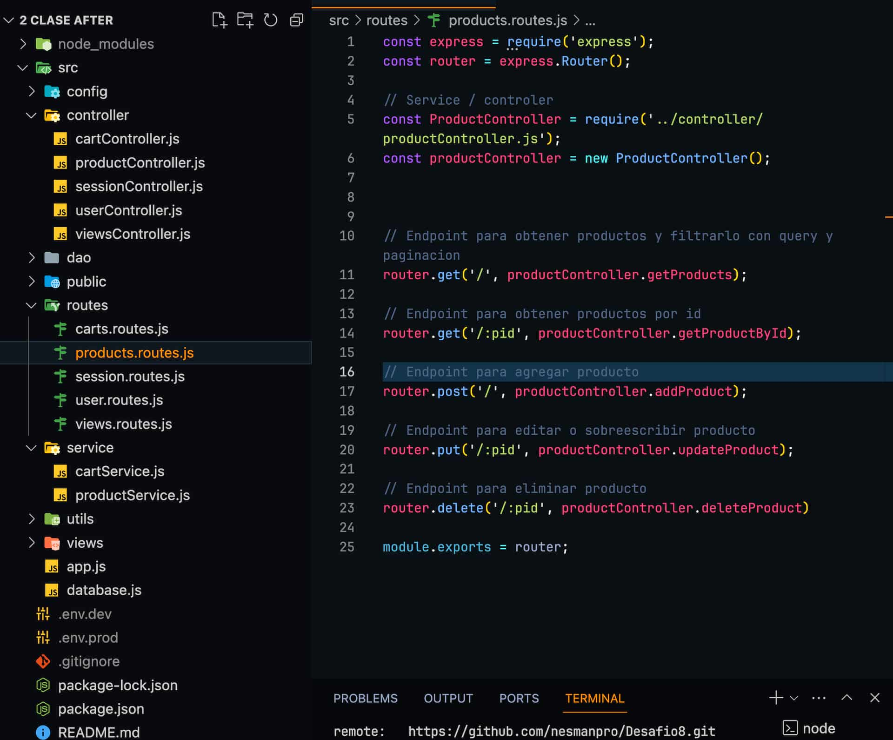

## Desafío Entregable

### Descripción

Este es un proyecto de backend desarrollado con Node.js y Express.js que proporciona una API para gestionar productos, usuarios, sesiones y carritos de compra. Utiliza una base de datos MongoDB para almacenar la información.

### Tecnologías utilizadas

- **Node.js**: Entorno de ejecución para JavaScript.
- **Express.js**: Marco de aplicación web para Node.js.
- **MongoDB**: Base de datos NoSQL utilizada para almacenar datos.
- **Passport.js**: Middleware de autenticación para Node.js.
- **Bcrypt**: Biblioteca para el hash de contraseñas.
- **Multer**: Middleware para manejar formularios con datos de tipo `multipart/form-data`.
- **dotenv**: Módulo para cargar variables de entorno desde archivos `.env`.

### Estructura del proyecto

El proyecto está dividido en varias partes:

- **Controladores**: Manejan las solicitudes HTTP y la lógica de negocio.
- **Servicios**: Contienen la lógica de negocio y realizan operaciones en la base de datos.
- **Rutas**: Definen las rutas de la API y vinculan las solicitudes HTTP a los controladores correspondientes.
- **Modelos**: Definen la estructura de los documentos almacenados en la base de datos.
- **Configuración**: Define la configuración del proyecto, incluyendo la conexión a la base de datos y las variables de entorno.

### Configuración del Servidor

El archivo `config/dotenv.config.js` maneja la carga de las variables de entorno utilizando la biblioteca `dotenv`. Dependiendo del modo de ejecución (`production` o `development`), carga las variables de entorno correspondientes del archivo `.env` adecuado.

### Notas adicionales

- El proyecto incluye la autenticación de usuario con Passport.js, utilizando las estrategias local y de GitHub.
- Proporciona una API RESTful para la gestión de productos y carritos de compra.
- Se utiliza Multer para manejar el envío de archivos, especialmente imágenes de productos.
- La estructura del proyecto está diseñada para facilitar el mantenimiento y la escalabilidad mediante la separación de responsabilidades.
